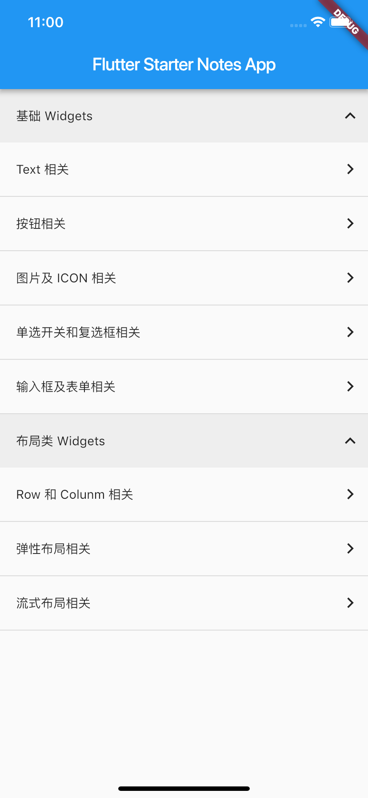

# Flutter Starter Notes

🤹‍ ️Wow!!! A flutter starter notes project for beginner

## Screenshot

## How to use this note project

This project is accord to the open source book: [https://github.com/flutterchina/flutter-in-action](https://github.com/flutterchina/flutter-in-action)

Learn this project together with the open source book will much be better.

## Project Directory

### 1. Text 相关

[SouceCode: TextAbout.dart](./lib/ui/TextAbout.dart)

[BookLink: 文本字体样式](https://book.flutterchina.club/chapter3/text.html)

### 2. Button 相关

[SouceCode: ButtonAbout.dart](./lib/ui/ButtonAbout.dart)

[BookLink: 按钮](https://book.flutterchina.club/chapter3/buttons.html)