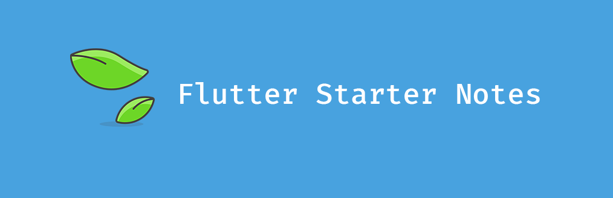

# Flutter 新手实践笔记

  

# 关于

🤹‍ ️Wow!!! 这是一个用来给 Flutter 新手进行实践，对比的学习项目。

# 如何使用

本项目的结构和开源电子书 [https://github.com/flutterchina/flutter-in-action](https://github.com/flutterchina/flutter-in-action) 目录保持一致，学习的时候可以一边学习书籍内容，一边参考此项目进行代码实践。

# 目录

- [1. 基础 Widgets](#1-基础-widgets)
    - [1.1. 文本、字体样式](#11-文本字体样式)
    - [1.2. 按钮](#12-按钮)
    - [1.3. 图片和 Icon](#13-图片和-icon)
    - [1.4. 单选开关和复选框](#14-单选开关和复选框)
    - [1.5. 输入框及表单](#15-输入框及表单)
- [2. 布局类 Widgets](#2-布局类-widgets)
    - [2.1. 线性布局 Row、Column](#21-线性布局-rowcolumn)
    - [2.2. 弹性布局 Flex](#22-弹性布局-flex)
    - [2.3. 流式布局Wrap、Flow](#23-流式布局wrapflow)
    - [2.4. 层叠布局 Stack、Positioned](#24-层叠布局-stackpositioned)
- [3. 容器类 Widgets](#3-容器类-widgets)
    - [3.1. Padding](#31-padding)
    - [3.2. 布局限制类容器 ConstrainedBox、SizeBox](#32-布局限制类容器-constrainedboxsizebox)
    - [3.3. 装饰容器 DecoratedBox](#33-装饰容器-decoratedbox)
    - [3.4. 变换 Transform](#34-变换-transform)
    - [3.5. Container](#35-container)
    - [3.6. Scaffold、TabBar、底部导航](#36-scaffoldtabbar底部导航)
- [4. 可滚动 Widgets](#4-可滚动-widgets)
    - [4.1. SingleChildScrollView](#41-singlechildscrollview)
    - [4.2. ListView](#42-listview)
    - [4.3. GridView](#43-gridview)
    - [4.4. CustomScrollView](#44-customscrollview)
    - [4.5. 滚动监听及控制 ScrollController](#45-滚动监听及控制-scrollcontroller)
- [5. 功能型 Widgets](#5-功能型-widgets)
    - [5.1. 导航返回拦截-WillPopScope](#51-导航返回拦截-willpopscope)
    - [5.2. 数据共享-InheritedWidget](#52-数据共享-inheritedwidget)
    - [5.3. 主题-Theme](#53-主题-theme)
- [贡献](#贡献)

## 1. 基础 Widgets

### 1.1. 文本、字体样式

[SouceCode: TextAbout.dart](./lib/ui/TextAbout.dart)

[BookLink: 文本、字体样式](https://book.flutterchina.club/chapter3/text.html)

### 1.2. 按钮

[SouceCode: ButtonAbout.dart](./lib/ui/ButtonAbout.dart)

[BookLink: 按钮](https://book.flutterchina.club/chapter3/buttons.html)

### 1.3. 图片和 Icon

[SouceCode: ImageAndIconAbout.dart](./lib/ui/ImageAndIconAbout.dart)

[BookLink: 图片和 Icon](https://book.flutterchina.club/chapter3/img_and_icon.html)

### 1.4. 单选开关和复选框

[SouceCode: SwitchAndCheckBoxAbout.dart](./lib/ui/SwitchAndCheckBoxAbout.dart)

[BookLink: 单选开关和复选框](https://book.flutterchina.club/chapter3/radio_and_checkbox.html)

### 1.5. 输入框及表单

[SouceCode: InputAndFormAbout.dart](./lib/ui/InputAndFormAbout.dart)

[BookLink: 输入框及表单](https://book.flutterchina.club/chapter3/input_and_form.html)

## 2. 布局类 Widgets

### 2.1. 线性布局 Row、Column

[SouceCode: RowAndColumnAbout.dart](./lib/ui/RowAndColumnAbout.dart)

[BookLink: 线性布局 Row、Column](https://book.flutterchina.club/chapter4/row_and_column.html)

### 2.2. 弹性布局 Flex

[SouceCode: FlexAbout.dart](./lib/ui/FlexAbout.dart)

[BookLink: 弹性布局 Flex](https://book.flutterchina.club/chapter4/flex.html)

### 2.3. 流式布局Wrap、Flow

[SouceCode: WrapAndFlowAbout.dart](./lib/ui/WrapAndFlowAbout.dart)

[BookLink: 流式布局Wrap、Flow](https://book.flutterchina.club/chapter4/wrap_and_flow.html)

### 2.4. 层叠布局 Stack、Positioned

[SouceCode: StackAndPositionedAbout.dart](./lib/ui/StackAndPositionedAbout.dart)

[BookLink: 层叠布局 Stack、Positioned](https://book.flutterchina.club/chapter4/stack.html)

## 3. 容器类 Widgets

### 3.1 Padding

[SouceCode: PaddingAbout.dart](./lib/ui/PaddingAbout.dart)

[BookLink: Padding](https://book.flutterchina.club/chapter5/padding.html)

### 3.2 布局限制类容器 ConstrainedBox、SizeBox

[SouceCode: BoxAbout.dart](./lib/ui/BoxAbout.dart)

[BookLink: 布局限制类容器 ConstrainedBox、SizeBox](https://book.flutterchina.club/chapter5/constrainedbox_and_sizebox.html)

### 3.3 装饰容器 DecoratedBox

[SouceCode: DecoratedBoxAbout.dart](./lib/ui/DecoratedBoxAbout.dart)

[BookLink: 装饰容器 DecoratedBox](https://book.flutterchina.club/chapter5/decoratedbox.html)

### 3.4 变换 Transform

[SouceCode: TransformAbout.dart](./lib/ui/TransformAbout.dart)

[BookLink: 变换 Transform](https://book.flutterchina.club/chapter5/transform.html)

### 3.5 Container

[SouceCode: ContainerAbout.dart](./lib/ui/ContainerAbout.dart)

[BookLink: Container](https://book.flutterchina.club/chapter5/container.html)

### 3.6 Scaffold、TabBar、底部导航

[SouceCode: MaterialContainerAbout.dart](./lib/ui/MaterialContainerAbout.dart)

[BookLink: Scaffold、TabBar、底部导航](https://book.flutterchina.club/chapter5/material_scaffold.html)

## 4. 可滚动 Widgets

### 4.1 SingleChildScrollView

[SouceCode: SingleChildScrollAbout.dart](./lib/ui/SingleChildScrollAbout.dart)

[BookLink: SingleChildScrollView](https://book.flutterchina.club/chapter6/single_child_scrollview.html)

### 4.2 ListView

[SouceCode: ListViewAbout.dart](./lib/ui/ListViewAbout.dart)

[BookLink: ListView](https://book.flutterchina.club/chapter6/listview.html)

### 4.3 GridView

[SouceCode: GridViewAbout.dart](./lib/ui/GridViewAbout.dart)

[BookLink: GridView](https://book.flutterchina.club/chapter6/listview.html)

### 4.4 CustomScrollView

[SouceCode: CustomScrollViewAbout.dart](./lib/ui/CustomScrollViewAbout.dart)

[BookLink: CustomScrollView](https://book.flutterchina.club/chapter6/custom_scrollview.html)

### 4.5 滚动监听及控制 ScrollController

[SouceCode: ScrollControllerAbout.dart](./lib/ui/ScrollControllerAbout.dart)

[BookLink: 滚动监听及控制 ScrollController](https://book.flutterchina.club/chapter6/scroll_controller.html)

## 5. 功能型 Widgets

### 5.1 导航返回拦截-WillPopScope

[SouceCode: WillPopScopeAbout.dart](./lib/ui/WillPopScopeAbout.dart)

[BookLink: 导航返回拦截-WillPopScope](https://book.flutterchina.club/chapter7/willpopscope.html)

### 5.2 数据共享-InheritedWidget

[SouceCode: InheritedWidgetAbout.dart](./lib/ui/InheritedWidgetAbout.dart)

[BookLink: 数据共享-InheritedWidget](https://book.flutterchina.club/chapter7/inherited_widget.html)

### 5.3 主题-Theme

[SouceCode: ThemeAbout.dart](./lib/ui/ThemeAbout.dart)

[BookLink: 主题-Theme](https://book.flutterchina.club/chapter7/theme.html)

## 贡献

👏👏👏 欢迎大家参与进项目的贡献！

